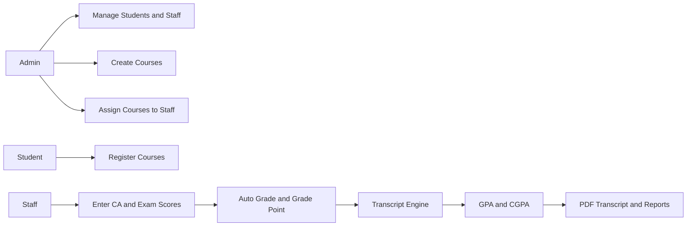

<div align="center">

# Student Academic Record Management System

### University of Delta, Agbor (UNIDEL) | Faculty of Computing

<p>
A premium, role-based academic management platform for handling student records,
course registration, grading workflows, and transcript generation.
</p>

<p>
  
  
  
  
  
</p>

<p>
  <a href="#-overview">Overview</a> •
  <a href="#-key-features">Features</a> •
  <a href="#-system-flow">System Flow</a> •
  <a href="#-quick-setup-xampp">Quick Setup</a> •
  <a href="#-project-structure">Structure</a>
</p>

</div>

---

## Overview

This project is a full-stack **Student Academic Record Management System (SARMS)** built for academic operations in a university environment.

It provides secure, role-based workflows for:

- **Admin**: manage students, staff, courses, and assignments
- **Staff**: enter CA and exam scores for assigned courses
- **Students**: register courses, track progress, and download transcripts

The platform emphasizes:

- centralized data management
- transparent grading process
- fast access to academic records
- clean dashboard-based user experience

---

## Key Features

### Core Academic Modules

- Role-based authentication: Admin, Staff, Student
- Student profile and academic record management
- Course creation and staff-course assignment
- Session-based course registration
- Grade entry with automatic grade and grade-point mapping
- GPA and CGPA calculations
- Transcript rendering and PDF downloads

### Experience and Presentation

- Modern responsive UI with Bootstrap and custom styling
- Dashboard cards and visual summary panels
- Print-friendly transcript views
- Structured workflow suitable for final-year presentation demos

### Data and Integrity

- MySQL relational schema with foreign keys and constraints
- Duplicate prevention for registrations and grade entries
- Included migration and fresh schema scripts

---

## System Flow



---

## Tech Stack

- **Backend:** PHP
- **Database:** MySQL
- **Frontend:** HTML5, CSS3, Bootstrap 5, JavaScript
- **Icons:** Bootstrap Icons
- **PDF:** Dompdf
- **Dependencies:** Composer

---

## Quick Setup (XAMPP)

### 1. Clone Project

```bash
git clone https://github.com/addicted56/Addicted.git
cd Addicted
```

### 2. Install Dependencies

```bash
composer install
```

### 3. Start Services

- Start **Apache** and **MySQL** in XAMPP
- Open **phpMyAdmin**

### 4. Create Database

Create a database, for example:

- `unidel_sarms`

### 5. Import SQL

Choose one:

- Fresh install: `database/unidel_schema.sql`
- Upgrade existing schema: `database/migrate.sql`

### 6. Configure Connection

Update DB credentials in `db.php`:

- host
- username
- password
- database name

### 7. Run in Browser

```text
http://localhost/Student-Management-System/
```

---

## Default Admin Login

If you imported `database/unidel_schema.sql`, default admin is:

- **Username:** `admin`
- **Password:** `password`

---

## Project Structure

```text
Student-Management-System/
|-- admin_login.php
|-- dashboard.php
|-- student_dashboard.php
|-- staff_dashboard.php
|-- manage_courses.php
|-- manage_staff.php
|-- assign_courses.php
|-- course_registration.php
|-- manage_grades.php
|-- transcript.php
|-- download_transcript.php
|-- download_pdf.php
|-- db.php
|-- styles.css
|-- database/
|   |-- migrate.sql
|   |-- unidel_schema.sql
```

---

## Presentation Notes (For Final Defense)

Use this project demo order for a smooth presentation:

1. Show role-based login (Admin, Staff, Student)
2. As Admin, create or manage course/staff records
3. As Staff, enter CA and exam scores
4. As Student, show dashboard, registration, and transcript
5. Download transcript PDF and explain GPA/CGPA output

This flow clearly demonstrates architecture, business logic, and real-world usability.

---

## Live Demo

https://studentprofile.gt.tc/

---

## License

This repository is intended for educational and academic demonstration purposes.
