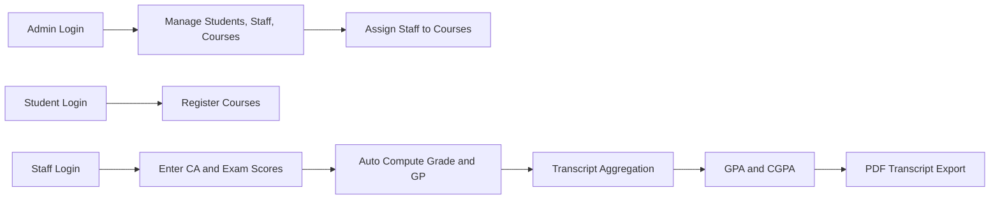

<div align="center">

# Student Academic Record Management System

### University of Delta, Agbor (UNIDEL) | Faculty of Computing

<p>
An enterprise-style academic records platform designed for final-year project defense,
production-like demonstrations, and clean role-based workflows.
</p>

<p>
  
  
  
  
  
</p>

<p>
  <a href="#overview">Overview</a> •
  <a href="#why-this-repo-stands-out">Why It Stands Out</a> •
  <a href="#capability-highlights">Capability Highlights</a> •
  <a href="#visual-gallery">Visual Gallery</a> •
  <a href="#quick-setup-xampp">Quick Setup</a>
</p>

</div>

---

## Overview

This project is a complete, role-based Student Academic Record Management System built to modernize academic workflows.

It demonstrates a real institutional flow from account access to final transcript export:

- Admin manages students, staff, courses, and course assignment
- Staff enters and updates CA plus exam scores for assigned courses
- Students register courses, track academic progress, and download transcript reports

The solution is designed to look polished during project presentation while still showing strong backend logic and data integrity.

---

## Why This Repo Stands Out

| Area | What Makes It Premium |
| --- | --- |
| Product feel | Dashboard-first UI with clear role journeys |
| Academic logic | Automatic grade, GPA, and CGPA computation |
| Data reliability | Foreign keys, uniqueness constraints, and role separation |
| Output quality | Printable transcript layout and PDF export pipeline |
| Demonstration strength | Structured final-defense flow and scenario-ready modules |

---

## Capability Highlights

### Access and Security

- Multi-role login for Admin, Staff, and Student
- Session-driven access control across all protected routes
- Password update flow for first-login users

### Academic Operations

- Student records management
- Course catalog management and staff assignment
- Student course registration by academic session
- Grade input with automatic grade-point mapping
- Transcript assembly and cumulative performance summary

### Reporting and Export

- Student reports generated as PDF
- Transcript export with GPA and CGPA summary
- Print-friendly transcript pages for physical documentation

---

## System Flow



---

## Visual Gallery

Presentation screens are available in the screenshots folder and can be shown live during defense.

<p align="center">
  
  
  
</p>

<p align="center">
  
  
  
</p>

---

## Tech Stack

- Backend: PHP
- Database: MySQL
- Frontend: HTML5, CSS3, Bootstrap 5, JavaScript
- Icon Library: Bootstrap Icons
- PDF Engine: Dompdf
- Dependency Management: Composer

---

## Quick Setup (XAMPP)

### 1. Clone Project

```bash
git clone https://github.com/addicted56/Addicted.git
cd Addicted
```

### 2. Install Dependencies

```bash
composer install
```

### 3. Start Apache and MySQL

- Open XAMPP
- Start Apache
- Start MySQL
- Open phpMyAdmin

### 4. Create Database

- Create: `unidel_sarms`

### 5. Import SQL Schema

- Fresh setup: `database/unidel_schema.sql`
- Migration path: `database/migrate.sql`

### 6. Configure Database Connection

Edit `db.php` and set your local:

- host
- username
- password
- database

### 7. Launch Application

```text
http://localhost/Student-Management-System/
```

---

## Default Admin Access

When `database/unidel_schema.sql` is imported:

- Username: `admin`
- Password: `password`

---

## Project Structure

```text
Student-Management-System/
|-- admin_login.php
|-- dashboard.php
|-- student_dashboard.php
|-- staff_dashboard.php
|-- manage_courses.php
|-- manage_staff.php
|-- assign_courses.php
|-- course_registration.php
|-- manage_grades.php
|-- transcript.php
|-- download_transcript.php
|-- download_pdf.php
|-- db.php
|-- styles.css
|-- screenshots/
|-- database/
|   |-- migrate.sql
|   |-- unidel_schema.sql
```

---

## Final Defense Demo Script

Use this order for a sharp and confident presentation:

1. Start with Admin login and show course/staff management
2. Switch to Staff login and enter grades
3. Switch to Student login and show registration and dashboard analytics
4. Open transcript page and explain GPA/CGPA logic
5. Export PDF transcript to demonstrate reporting quality

This sequence quickly proves system design, implementation depth, and practical relevance.

---

## License

This repository is intended for educational and academic presentation use.
